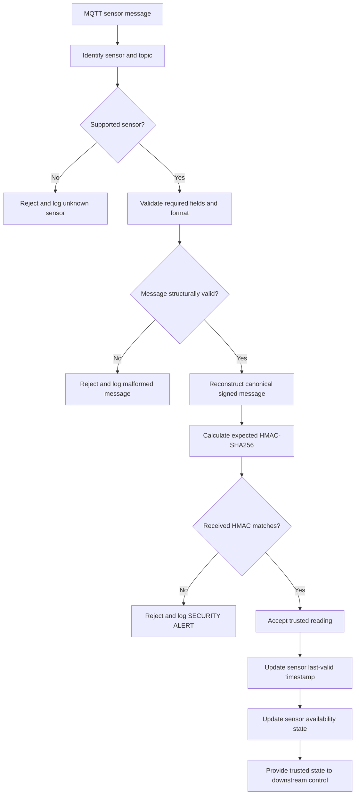
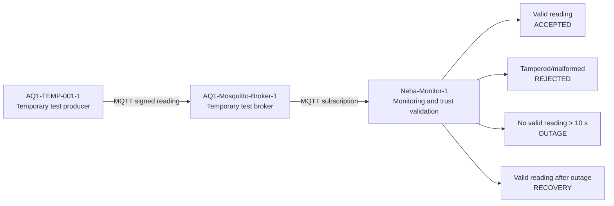
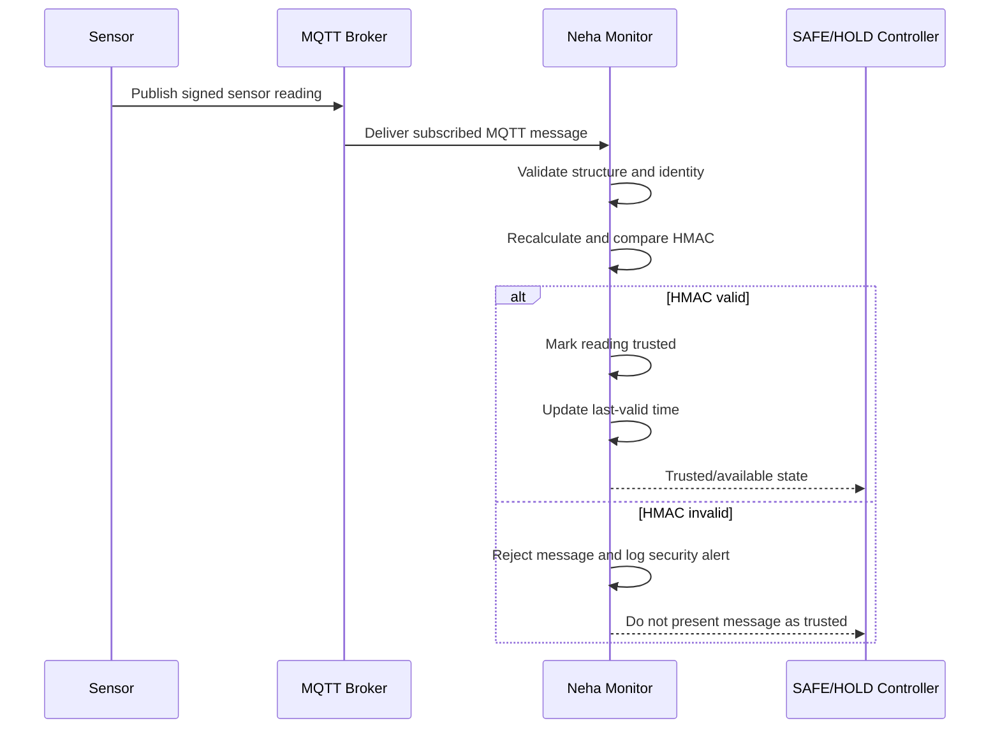
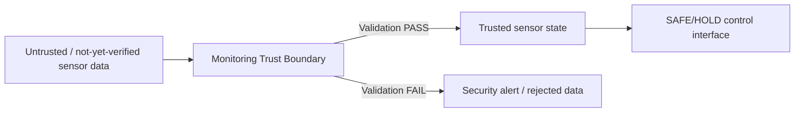

# Monitoring and Trust-Validation Design

**Owner:** Neha Thanait  
**Technical workstream:** Security Monitoring, Trust Validation and Security Testing

## Purpose

This document describes the design of the AQ-1 monitoring and trust-validation component before and alongside implementation. The component is responsible for deciding whether incoming sensor data can be trusted, detecting when expected sensors stop providing valid data, and producing security/availability state that can later be consumed by the SAFE/HOLD control component.

The design is intentionally separated from implementation evidence. Design explains how the component is intended to work; implementation and test records show what has actually been built and demonstrated.

## Design goals

The monitoring component is designed to:

- receive MQTT sensor messages
- identify supported sensor types and identities
- reject malformed or unknown messages
- verify HMAC-SHA256 integrity/authenticity for supported sensors
- accept only readings that pass validation
- ensure invalid/tampered readings do not reset sensor-health timers
- detect per-sensor outages
- detect sensor recovery only after a new valid reading arrives
- log accepted, rejected, outage and recovery events
- expose trusted/untrusted/availability state for later SAFE/HOLD integration

## High-level component design



## GNS3 validation architecture for this component

The Week 7 individual validation environment uses temporary support nodes so the monitoring component can be tested independently.



The temporary producer and broker in this validation environment are support components, not ownership claims over Sahil's final sensor/network/broker workstream. The final system is intended to integrate Neha's monitoring component with Sahil's secured MQTT/network path and Arnob's SAFE/HOLD controller.

## Inputs

### MQTT connection input

The monitor subscribes to project sensor topics, currently including:

- `aquaculture/sensors/#`
- `aq1/pond1/#`

The current GNS3 test uses the broker address supplied through the `AQ1_MQTT_BROKER` environment variable.

### Dissolved-oxygen message input

The DO monitoring path expects a known DO sensor identity and the fields required by the existing DO implementation. Its signature is based on the canonical representation used by the DO producer.

### Temperature message input

The temperature path expects:

- `sensor_id`
- `pond_id`
- `sensor_type`
- `value`
- `unit`
- `status`
- `timestamp`
- `hmac`

The temperature canonical message design is:

```text
sensor_id|pond_id|sensor_type|value|unit|status|timestamp
```

The monitor calculates an HMAC-SHA256 over the canonical message and compares it with the HMAC supplied in the payload.

## Outputs

The component produces operational/security states rather than directly controlling an actuator.

Key outputs are:

- `ACCEPTED` — message passed required validation and HMAC verification
- `SECURITY ALERT` — message was rejected because integrity/authenticity validation failed
- malformed/unknown rejection — invalid structure or unsupported identity
- `OUTAGE ALERT` — no valid reading from an expected sensor for longer than the configured threshold
- `RECOVERY` — a previously unavailable sensor produced a new valid reading

The planned integration output for Arnob's controller is a trusted sensor/availability state. SAFE/HOLD should consume this verified state rather than raw MQTT sensor messages.

## Normal-operation flow



The controller connection shown above is a design interface. Full SAFE/HOLD integration is still pending and must not be described as implemented until Arnob's component is working and tested.

## Tamper-handling design

A tamper attempt may preserve the original HMAC but change one or more protected fields after signing.

Example:

```text
Original signed reading: 27.2 C / NORMAL
Modified payload:        41.2 C / HIGH
Original HMAC retained:  yes
```

Because the monitor reconstructs the canonical message using the received fields, its calculated HMAC is different from the original HMAC. The design response is:

```text
HMAC mismatch -> reject reading -> security alert -> do not update last-valid timer
```

This prevents forged data from both influencing the trusted data path and falsely keeping an unavailable sensor marked healthy.

## Outage-detection design

The monitor maintains a separate last-valid timestamp for each expected sensor.

Current timeout design:

`10 seconds`

```mermaid
stateDiagram-v2
    [*] --> Waiting
    Waiting --> Online: first valid reading
    Online --> Online: valid reading / update last-valid
    Online --> Online: invalid reading / reject; timer unchanged
    Online --> Outage: >10 s since last valid reading
    Outage --> Outage: invalid reading / remain unavailable
    Outage --> Online: valid reading / log RECOVERY
```



Important design rule: only a valid message can change the last-valid timestamp. Invalid or tampered messages cannot prevent an outage alert.

## Security controls

### HMAC-SHA256

Purpose:

- detect modification of protected message fields
- provide message authenticity/integrity when the sender and verifier share the correct secret

HMAC does not encrypt the payload and is not treated as a confidentiality control.

### Constant-time HMAC comparison

The implementation uses a constant-time comparison approach for received and calculated HMAC values to reduce information leakage through normal string comparison behaviour.

### Environment-based configuration

The temperature HMAC key and GNS3 broker address are supplied through environment variables in the current design/test setup rather than being placed directly in screenshots or committed credential files.

### Valid-data-only health updates

This is both an integrity and availability design control: forged messages cannot keep a compromised or failed sensor marked online.

## Trust boundaries and interfaces



Sensor data is considered untrusted when it arrives from MQTT. It crosses the monitoring trust boundary only after the required checks pass.

## Failure and attack behaviour

| Condition | Designed response |
|---|---|
| Valid known sensor + valid HMAC | Accept, log, update last-valid time |
| Known sensor + HMAC mismatch | Reject, security alert, do not update last-valid |
| Malformed payload | Reject and log |
| Unknown sensor | Reject/log unsupported identity |
| Expected sensor stops sending valid data | Outage alert after threshold |
| Invalid messages continue during outage | Remain in outage state |
| Valid message returns after outage | Recovery event, return online |
| Broker unavailable | Monitor cannot receive data; availability handling should ultimately contribute to safe system behaviour |

## Design decisions and reasons

### Per-sensor health tracking

A single global 'last message' timer would allow one active sensor to hide the failure of another. Each expected sensor therefore has its own last-valid timestamp and outage state.

### Verify before updating availability

If the system updated sensor-health state before HMAC verification, forged traffic could prevent outage detection. Validation therefore happens before last-valid state is updated.

### Separate monitoring from control

The monitor determines trust and availability. The SAFE/HOLD controller is a separate component responsible for deciding the safe actuator/control response. This separation makes ownership, testing and integration clearer.

### Temporary support nodes for individual GNS3 testing

The monitoring component needs a producer and broker to test its interfaces. Temporary GNS3 TEMP-001 and Mosquitto nodes are therefore used in Neha's individual validation environment. The final secured broker/network design remains Sahil's technical workstream.

## Current design limitations / pending work

The following are not yet complete:

- GNS3 broker-side authentication enforcement in Neha's temporary validation environment
- dedicated authenticated monitoring-client credentials
- MQTT topic ACL enforcement
- final Pond A routed/router-firewall topology
- packet-capture/Wireshark verification
- pH monitoring path
- DO validation across the GNS3 network
- SAFE/HOLD integration
- Node-RED/dashboard integration
- TLS verification

## Acceptance criteria for the monitoring component

The component can be considered successfully demonstrated for a sensor path when:

1. the monitoring process runs on its intended node/environment
2. it receives a signed sensor message through MQTT
3. a correct HMAC is accepted
4. a modified signed payload is rejected
5. malformed/unsupported data is rejected as applicable
6. stopping valid data produces an outage for that sensor
7. invalid messages do not reset the outage timer
8. a subsequent valid reading produces recovery
9. events are visible in logs/terminal evidence
10. configuration and evidence do not expose secrets

## Current implementation and evidence links

Implementation:

- `scripts/monitoring/monitor.py`
- `docs/implementation/monitoring.md`

Individual progress/evidence:

- `docs/progress/neha-week7-individual-progress.md`
- `docs/gns3/week7-temp-monitor-validation.md`
- PR #3 — monitoring and outage work
- PR #14 — per-sensor outage/recovery
- PR #15 — DO HMAC verification/tamper rejection

Week 7 GNS3 evidence currently demonstrates:

- valid temperature HMAC acceptance — PASS
- temperature outage detection — PASS
- temperature recovery — PASS
- temperature tamper rejection — PASS

## Screenshot evidence plan

Clean screenshots should be stored or linked with enough context to identify the test being demonstrated. Recommended evidence set:

1. GNS3 topology showing separate TEMP-001, Mosquitto and Neha monitor nodes
2. `Neha-Monitor-1` showing successful broker connection/subscriptions
3. valid TEMP-001 reading showing `HMAC: VALID`
4. temperature `OUTAGE ALERT`
5. temperature `RECOVERY`
6. tamper-test publisher output together with monitor `HMAC verification failed`

Do not commit screenshots displaying MQTT passwords, HMAC keys or other secrets.

## Relationship between design, implementation and testing

```text
Monitoring design
      |
      v
monitor.py implementation
      |
      v
GNS3 deployment / configuration
      |
      v
valid + tamper + outage + recovery tests
      |
      v
screenshots / logs / Git history as evidence
```

This trace makes it possible to explain not only that the monitor works, but why it was designed this way and how the implementation was verified.
