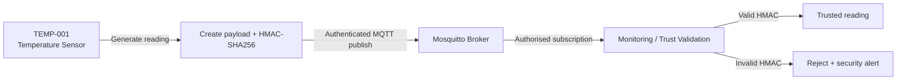
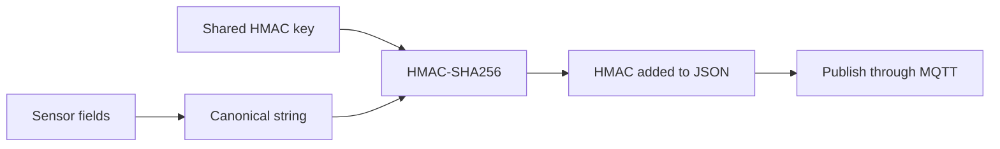
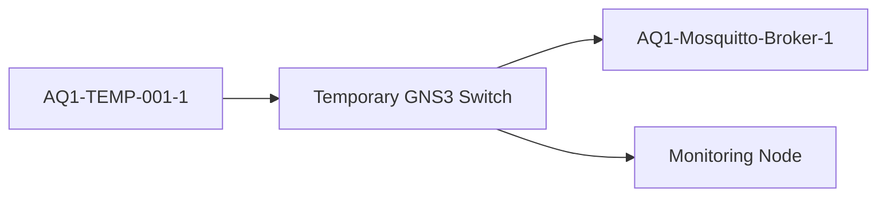
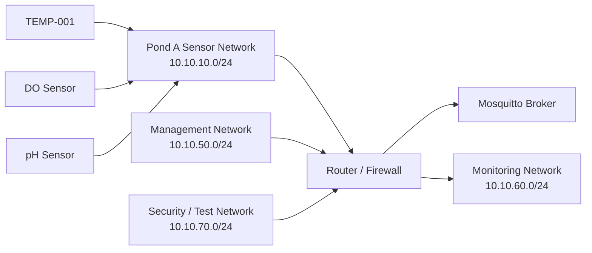
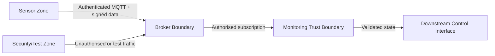

# Sensor, MQTT and Network Security Design

**Owner:** Sahil Basnet  
**Technical workstream:** Sensor, MQTT and Network Security

## Purpose

This document defines the design of the AQ-1 sensor communication, MQTT security and network-security workstream. It explains how sensor readings are generated, protected, transported and exposed to downstream monitoring, together with the security controls that should prevent unauthorised access or undetected message modification.

The document separates **design intent** from **implementation evidence**. Features marked implemented/tested have already been demonstrated. Features marked planned, pending or in progress must not be treated as complete until corresponding tests and evidence exist.

## Design goals

The workstream is designed to:

- give each sensor a clear identity and pond association
- publish readings through MQTT
- require authenticated MQTT access
- protect message integrity using HMAC-SHA256
- keep passwords and HMAC secrets outside committed source code
- support controlled tamper and unauthorised-client testing
- move communication away from localhost into separate GNS3 nodes
- enforce least-privilege MQTT topic access using ACLs
- separate sensor, broker, monitoring, management and security-test networks
- apply firewall rules between network zones
- support packet-capture evidence of real network traffic
- add TLS transport encryption after the routed MQTT path is stable

## Scope and responsibility boundaries

This workstream owns the secure path from sensor generation to MQTT/network delivery.

Current responsibilities include:

- `TEMP-001` temperature sensor
- temperature message structure and status calculation
- MQTT publishing
- Mosquitto broker authentication
- environment-based credential loading
- HMAC-SHA256 generation
- controlled temperature tamper testing
- unauthorised MQTT connection testing
- GNS3 sensor/broker/network integration
- planned topic ACLs
- planned routing, segmentation and firewall verification
- planned Wireshark/GNS3 packet capture
- planned TLS

The monitoring/trust-validation component is owned separately. The SAFE/HOLD controller is also a separate component. This design defines the interfaces needed to integrate with those components without claiming ownership of their internal logic.

## High-level subsystem design



The intended security sequence is:

```text
SENSE -> SIGN -> AUTHENTICATE -> SEND -> VERIFY -> TRUST / REJECT
```

## Sensor identity and message design

The current temperature sensor uses:

```text
Sensor ID:   TEMP-001
Pond ID:     POND-01
Sensor type: temperature
```

The sensor produces a JSON payload containing:

```json
{
  "sensor_id": "TEMP-001",
  "pond_id": "POND-01",
  "sensor_type": "temperature",
  "value": 27.2,
  "unit": "C",
  "status": "NORMAL",
  "timestamp": "...",
  "hmac": "..."
}
```

Temperature status is currently classified as:

```text
below 25 C    -> LOW
25 C to 29 C  -> NORMAL
above 29 C    -> HIGH
```

The timestamp is included so each signed message represents one specific sensor event.

## MQTT communication design

The system uses a publish/subscribe pattern.

```text
TEMP-001
   |
   | publish
   v
Mosquitto MQTT Broker
   |
   | subscribed delivery
   v
Monitoring Component
```

The current temperature topic is:

```text
aq1/pond1/temperature
```

The existing dissolved-oxygen path currently uses:

```text
aquaculture/sensors/dissolved_oxygen
```

These topic structures are inconsistent. Topic standardisation is therefore required before final ACL rules are locked in.

A preferred final structure is:

```text
aq1/pond1/sensors/temperature
aq1/pond1/sensors/dissolved_oxygen
aq1/pond1/sensors/ph
```

This structure makes pond, device class and sensor type explicit and is easier to protect using ACL patterns.

## MQTT authentication design

The secured Mosquitto configuration should not allow anonymous clients.

The temperature sensor loads MQTT credentials from environment variables:

```text
AQ1_MQTT_USERNAME
AQ1_MQTT_PASSWORD
```

Expected behaviour:

```text
Valid credentials
       |
       v
Connection accepted

Missing / invalid credentials
       |
       v
Connection rejected
```

Local testing has already demonstrated rejection of an unauthorised client with a `not authorised` connection error.

The monitoring client must also authenticate before the final broker configuration is considered fully secured.

## HMAC-SHA256 integrity design

MQTT authentication and message integrity solve different problems.

- MQTT authentication answers: **Is this client permitted to connect?**
- HMAC answers: **Has this protected message been modified, and does it possess the shared integrity secret?**

The temperature path protects this canonical string:

```text
sensor_id|pond_id|sensor_type|value|unit|status|timestamp
```

Example:

```text
TEMP-001|POND-01|temperature|27.2|C|NORMAL|timestamp
```

The producer calculates an HMAC-SHA256 using the configured shared key and sends the result in the payload.



The monitor reconstructs the same canonical string and calculates its own HMAC. A matching value is accepted as trusted; a mismatch is rejected.

HMAC provides integrity/authenticity for the protected fields. It does **not** encrypt the MQTT payload and must not be described as confidentiality protection.

## Secret-handling design

Secrets should not be hard-coded in committed Python files.

The temperature HMAC key is supplied through:

```text
AQ1_TEMP_HMAC_KEY
```

MQTT credentials are also supplied through environment variables.

Password files, keys, tokens and screenshots containing secret values must not be committed to the repository.

## Tamper-handling design

The controlled tamper client is deliberately separate from the legitimate sensor process.

Test flow:

```text
Create legitimate reading
        |
        v
Generate valid HMAC
        |
        v
Modify protected field(s)
        |
        v
Keep original HMAC
        |
        v
Publish altered payload
        |
        v
Monitor recalculates HMAC
        |
        v
Mismatch -> REJECT
```

Example:

```text
Original: 27.2 C / NORMAL
Tampered: 41.2 C / HIGH
HMAC:     original HMAC retained
```

The expected result is an HMAC verification failure. A rejected/tampered reading must not refresh the valid sensor-health timestamp.

This behaviour is important because otherwise malicious traffic could keep a failed sensor falsely marked as available.

## Topic ACL design

The final MQTT broker should follow least privilege.

For example, the TEMP-001 account should be permitted to publish only the temperature topic required for that sensor.

```text
TEMP-001 account
    |
    +-- ALLOW publish -> aq1/pond1/sensors/temperature
    |
    +-- DENY publish  -> other sensor topics
    +-- DENY publish  -> control/admin topics
```

Monitoring credentials should be granted only the subscriptions needed for validation/monitoring.

ACL design remains **in progress** and must be tested with both allowed and denied publish/subscribe cases before being marked complete.

## GNS3 network-security design

The first demonstrated GNS3 security slice used separate virtual nodes for the temperature sensor, broker and monitoring component. This proved that the project could move beyond a localhost-only prototype.

The first demonstrated slice is conceptually:



This temporary flat topology is useful for integration validation but is **not** the final Pond A network design.

## Target Pond A network design

The required next architecture is a routed Pond A path.



Current project addressing direction:

| Zone | Subnet | Status |
|---|---|---|
| Pond A | `10.10.10.0/24` | Required MVP |
| Pond B | `10.10.20.0/24` | Future/stretch |
| Pond C | `10.10.30.0/24` | Future/stretch |
| Management | `10.10.50.0/24` | Planned |
| Monitoring | `10.10.60.0/24` | Planned |
| Security/Test | `10.10.70.0/24` | Planned |

Pond B and Pond C must not be described as implemented until they are actually deployed and tested.

## Network segmentation and firewall design

The routed design should enforce explicit communication paths rather than unrestricted connectivity.

Expected policy direction:

| Source | Destination | Intended policy |
|---|---|---|
| Pond A sensors | MQTT broker | Allow required MQTT traffic only |
| Pond A sensors | Management network | Deny unless specifically required |
| Monitoring node | MQTT broker | Allow authenticated MQTT subscription |
| Management | Required infrastructure | Allow only required administration traffic |
| Security/Test network | Production zones | Deny by default; permit only controlled test cases |
| Unauthorised networks | Broker/admin services | Deny |

Exact interface addresses and rules should be documented only after the routed topology is implemented.

## Packet-capture design

GNS3/Wireshark evidence should prove that MQTT traffic is really crossing the intended network path.

Required capture goals include:

- TEMP-001 traffic reaching the broker
- broker traffic reaching the monitoring node
- source/destination IP evidence
- successful allowed traffic
- blocked traffic where firewall/ACL tests require it
- MQTT/TCP behaviour before and after TLS is enabled

Packet capture remains pending.

## Transport-security / TLS design

The current MQTT prototype uses plaintext MQTT transport on port `1883`.

HMAC protects message integrity but does not provide confidentiality. Therefore TLS remains a separate planned control.

Target direction:

```text
MQTT 1883 (current prototype)
        |
        v
MQTT over TLS 8883 (planned)
```

TLS should be added only after the routed MQTT path, authentication and ACL behaviour are stable enough to test systematically.

## Trust boundaries



Important boundaries are:

- client-to-broker authentication boundary
- sensor-network-to-broker routing/firewall boundary
- broker-to-monitor subscription boundary
- monitor validation boundary
- security/test network boundary

## Failure and attack behaviour

| Condition | Designed response |
|---|---|
| Valid MQTT credentials + valid signed payload | Deliver to monitor; valid HMAC may be trusted |
| Missing/invalid MQTT credentials | Broker rejects connection |
| Authenticated client sends tampered payload | Broker may route it; monitor rejects HMAC |
| Sensor publishes to unauthorised topic | ACL should reject operation once ACLs are implemented |
| Sensor stops sending valid readings | Monitoring should detect outage |
| Tampered messages continue during outage | Must not refresh valid sensor-health state |
| Forbidden network path attempted | Firewall should block and test should record result |
| Broker unavailable | Sensor/monitor communication fails; availability handling should contribute to safe system behaviour |
| Plaintext transport intercepted | Payload can be observed; TLS is required for confidentiality in final hardening |

## Design decisions and reasons

### MQTT

MQTT was selected because it provides lightweight publish/subscribe messaging suitable for sensor communication and supports broker-side authentication, ACLs and TLS.

### Eclipse Mosquitto

Mosquitto was selected as the broker because it is lightweight, widely used and supports the security controls required by this prototype.

### HMAC-SHA256

HMAC-SHA256 was selected to detect modification of protected readings and provide shared-secret message authenticity between producer and verifier.

### Environment variables

Environment variables reduce the risk of committing passwords or HMAC secrets directly into source code.

### Separate tamper client

A separate tamper client allows controlled malicious-message testing without changing the normal sensor implementation.

### GNS3

GNS3 is used so sensor, broker and monitoring processes can run on separate network nodes and generate real routed traffic rather than only communicating through localhost.

### Security/test network

A dedicated security/test zone provides a clear source for controlled unauthorised access, scanning or attack simulations without treating those actions as normal sensor behaviour.

## Current status

| Component / control | Status |
|---|---|
| TEMP-001 temperature producer | Tested / PASS |
| Temperature MQTT communication | Tested / PASS |
| Temperature HMAC generation | Tested / PASS |
| Temperature HMAC verification | Tested / PASS |
| Local Mosquitto authentication | Tested / PASS |
| Local unauthorised MQTT rejection | Tested / PASS |
| Controlled temperature tamper test | Tested / PASS |
| Separate GNS3 TEMP/broker/monitor nodes | Tested / PASS |
| GNS3 valid temperature HMAC | Tested / PASS |
| GNS3 temperature tamper rejection | Tested / PASS |
| GNS3 temperature outage/recovery | Tested / PASS |
| Routed Pond A | In progress |
| GNS3 broker authentication hardening | Pending |
| Authenticated monitoring client | Pending |
| Standardised topic structure | In progress |
| Topic ACL enforcement | In progress |
| Firewall/segmentation tests | Pending |
| Packet capture | Pending |
| DO in final routed GNS3 path | Pending |
| pH sensor path | Pending |
| TLS | Planned |
| SAFE/HOLD integration | Separate pending integration |

## Current limitations and pending work

The current implementation should not be described as a finished secure production network.

Remaining work includes:

- complete the routed Pond A topology
- move the secured broker configuration into the GNS3 environment
- authenticate the monitoring MQTT client
- standardise MQTT topics
- implement and test topic ACLs
- configure and test firewall rules
- capture and document packets across the real routed path
- integrate DO into the final routed path
- implement/integrate pH only after the core path is stable
- integrate with SAFE/HOLD through the monitoring trust state
- add TLS after authentication/routing/ACL behaviour is stable

## Acceptance criteria

This workstream can be considered complete for the Pond A MVP when:

1. TEMP-001 operates as a separate node on the Pond A GNS3 network.
2. Sensor traffic reaches the broker through the intended routed/firewall path.
3. Mosquitto requires valid credentials.
4. The monitoring MQTT client also authenticates.
5. Anonymous or invalid-credential clients are rejected.
6. Topic ACLs allow required sensor traffic and reject unauthorised topics.
7. Valid HMAC-protected readings are accepted by the monitoring layer.
8. Tampered protected readings are rejected.
9. Invalid/tampered traffic does not falsely refresh sensor-health state.
10. Firewall allow/deny behaviour is tested and evidenced.
11. Packet captures prove the actual sensor-to-broker-to-monitor path.
12. Documentation links the design to implementation, tests and evidence without exposing secrets.

TLS is an important hardening goal but can remain a later enhancement if the project plan continues to classify it as stretch work.

## Implementation and evidence links

Current implementation areas:

- `scripts/sensors/temperature_sensor.py`
- `scripts/security/temperature_tamper_test.py`
- `scripts/monitoring/monitor.py`
- `docs/implementation/temperature-sensor.md`
- `docs/implementation/mqtt-broker.md`
- `docs/security/temperature-mqtt-security.md`
- `docs/gns3/week7-temp-monitor-validation.md`
- `testing/Week_6_Security_Test_Plan.md`
- `testing/security-test-results.md`

Recorded technical commits for this workstream include:

- `9a5216d` — authenticated temperature sensor MQTT flow
- `e98556c` — HMAC protection and temperature tamper test
- `fa4ac7c` — HMAC integrity protection for temperature sensor

## Evidence plan

Useful evidence for this workstream should prove specific engineering claims rather than simply showing code.

Recommended evidence includes:

1. TEMP-001 running and publishing signed readings
2. authorised MQTT subscriber receiving temperature messages
3. Mosquitto listener/authentication configuration without exposed credentials
4. unauthorised MQTT client rejected
5. valid temperature HMAC accepted
6. controlled tamper client publishing modified data
7. tampered temperature message rejected
8. GNS3 topology showing separate TEMP-001, broker and monitor nodes
9. GNS3 valid reading, outage, recovery and tamper-rejection evidence
10. routed Pond A topology when completed
11. firewall allow/deny test evidence when completed
12. MQTT ACL allow/deny evidence when completed
13. Wireshark/GNS3 packet capture when completed
14. Git history showing the technical implementation commits

Do not commit screenshots or logs that expose passwords, HMAC keys, tokens or private keys.

## Relationship between design, implementation and testing

```text
Sensor / MQTT / network-security design
              |
              v
Sensor + broker + configuration implementation
              |
              v
GNS3 routed deployment
              |
              v
Authentication + HMAC + ACL + firewall tests
              |
              v
Packet captures + screenshots + logs + Git history
              |
              v
Assessment evidence
```

This trace allows the team to explain not only what was built, but why each security control exists and how the implementation was validated.